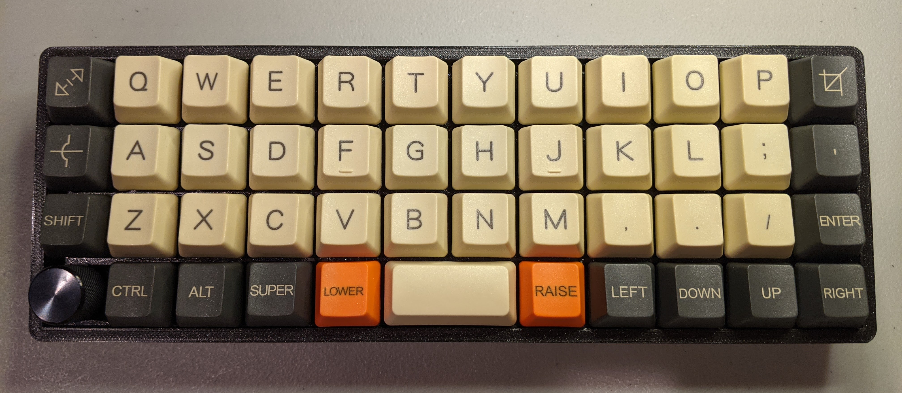
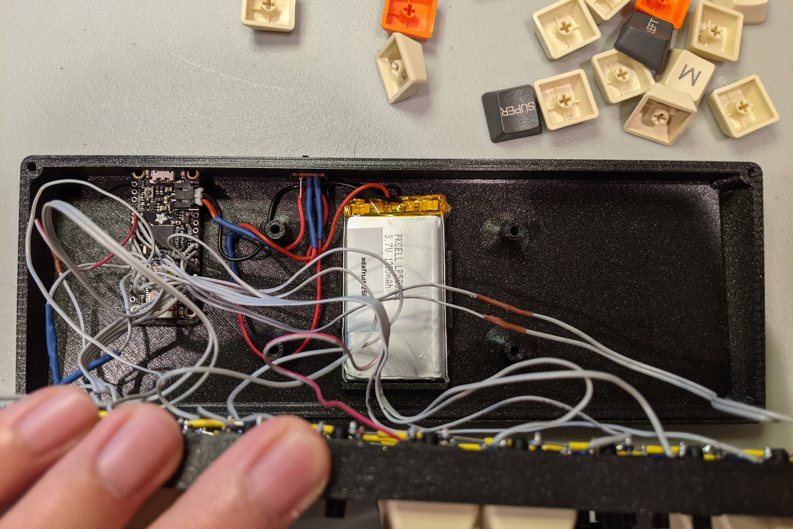
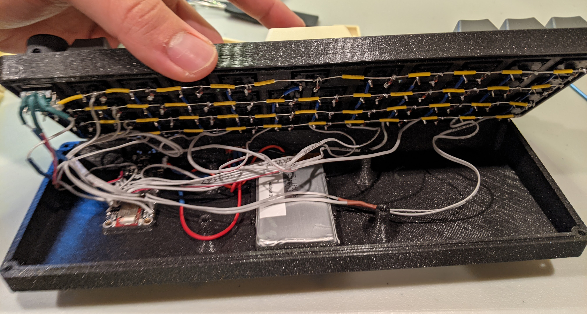
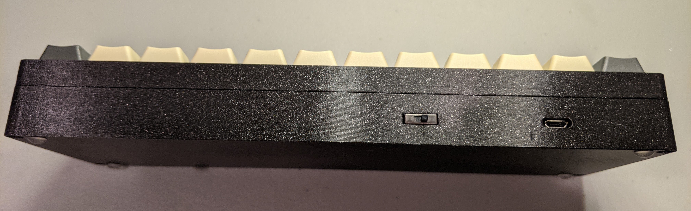

# Bloid40

*A Bluetooth-capable, QMK-powered, handwired, 40% ortholinear keyboard*

The "Bloid 40" keyboard is a handwired 40% Bluetooth-capable ortholinear keyboard.[ Victor Lucachi](https://github.com/victorlucachi)'s open-sourced [VOID 40 keyboard](https://github.com/victorlucachi/void40) inspired this build, and is the source of this keyboard's portmanteau naming: "Bluetooth "+ "VOID40 "= "Bloid40". The exterior appearances of the Bloid40 and VOID40 are identical. The Bloid 40 features a different interior design for the bottom case, however, so that it can accommodate a [Bluefruit 32u4 LE](https://www.adafruit.com/product/2829) development board, instead of a controller with an Arduino Pro Micro footprint. The bottom case also has a fitting for the LiPoly battery, which powers the keyboard when unplugged, and also features a cut-out for a power switch, which can turn off the keyboard's connection to the battery. I'm grateful to Victor for sharing the solid body `.step` files of his case design. Remixing his design for Bluetooth support would have been very difficult otherwise. The two possible top casings—grid and MIT layouts—are identical to the VOID40's.

The firmware for the Bloid40 is rather different from the VOID40's, in order to support Bluetooth. In addition, the Bluefruit32u4's ATmega32u4 is clocked at 8 MHz, instead of 16 MHz. Both the Bloid40 and the Void40 use the fantastic open-sourced [QMK firmware](https://github.com/qmk/qmk_firmware). The firmware for the Bloid40 can be found [here](https://github.com/hanhanhan-kim/qmk_firmware/tree/master/keyboards/handwired/bloid40), on my fork of QMK.  

The power circuitry on the Bluefruit microcontroller enables automatic recharging of the battery when the keyboard is plugged in—unless, of course, the battery is disconnected from the Bluefruit, via the hardware switch. 

## BOM

In addition to standard electronics equipment and access to a 3D-printer:

| Item                         | Price (USD) | Quantity | Source                                                       |
| ---------------------------- | ----------- | -------- | ------------------------------------------------------------ |
| Bluefruit 32u4 LE            | 28.29       | 1        | DigiKey [1528-1517-ND](https://www.digikey.com/en/products/detail/adafruit-industries-llc/2829/5774320) |
| Lithium Ion Polymer battery* | 9.95        | 1        | DigiKey [1528-1838-ND](https://www.digikey.com/en/products/detail/adafruit-industries-llc/258/5054544?s=N4IgTCBcDaIIYBM4DMBOBXAlgFwARgFYAOEAXQF8g) |
| SPDT switch                  | 0.65        | 1        | DigiKey [EG1903-ND](https://www.digikey.com/en/products/detail/e-switch/EG1218/101726) |
| EC11 Rotary Encoder**        | 1.48        | 1        | DigiKey [PEC11-4215F-S0024-ND](https://www.digikey.com/en/products/detail/bourns-inc/PEC11-4215F-S0024/3534238) |
| Aluminum knob***             | 7.74        | 1        | DigiKey [226-1129-ND](https://www.digikey.com/en/products/detail/kilo-international/OEJA-63-2-7/710804) |

**Note*: You can swap out the LiPoly battery for some alternative one, but be careful. Adafruit recommends that you use one of their LiPoly batteries.

***Note*: Any EC11 rotary encoder should do, doesn't have to be the particular model specified here.  

*\***Note:* This knob can be replaced with some other similarly sized knob meant for 6.00 mm diameter shafts. 

For general guidance on handwiring keyboards, see [this link](https://www.ghost7.com/3d-printed-hand-wired-40-keyboard/), [this link](https://medium.com/cracked-the-code/a-complete-guide-to-building-a-hand-wired-keyboard-9d8c9cc7b041), and [this link](https://beta.docs.qmk.fm/using-qmk/guides/keyboard-building/hand_wire). All parts should press-fit into place, except for the battery. If you'd like, you can hot glue the battery into position, but I found that that's generally not necessary. 

## Known Issues

- The spinning of the rotary encoder works well when the keyboard is plugged in, but relays extremely delayed signals when the keyboard is in Bluetooth mode. Curiously, pressing the rotary encoder while in Bluetooth mode results in the sending of the correct signal, with minimal delay. Pressing any of the regular keys while in Bluetooth mode does not result in any perceptible delay. 
- QMK does not support NKRO (n-key rollover) on Bluetooth builds. 
- When switching from Bluetooth to wired use, I would suggest completely disconnecting the Bluetooth from the computer. Simultaneous USB and Bluetooth connections will result in strangeness. For example, on Windows, [keys will be registered twice](https://geekhack.org/index.php?topic=108859.0)—once via the USB connection, and again via the Bluetooth connection. On Linux (Ubuntu 18.04), simultaneous Bluetooth and USB connections result in perceptibly delayed keyboard presses. 

## Supplemental Photos

Some supplemental photos documenting the build and clarifying the above described features.

A photo of all the inside components positioned correctly:

Another photo of the insides, but with the handwired keyboard matrix:

A photo of the exterior backside, featuring the micro USB B port of the Bluefruit, and the slider switch for connecting and disconnecting the LiPoly battery to the microcontroller. 

